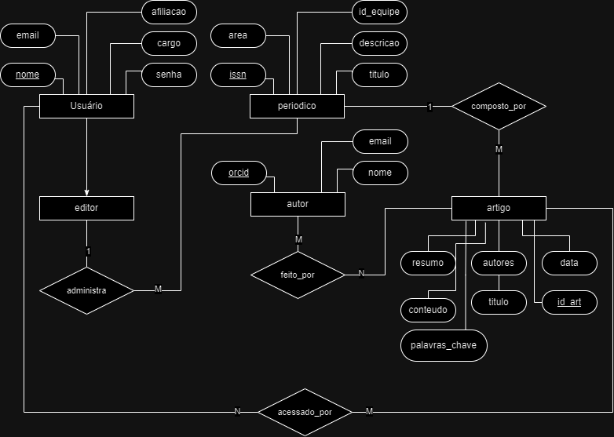
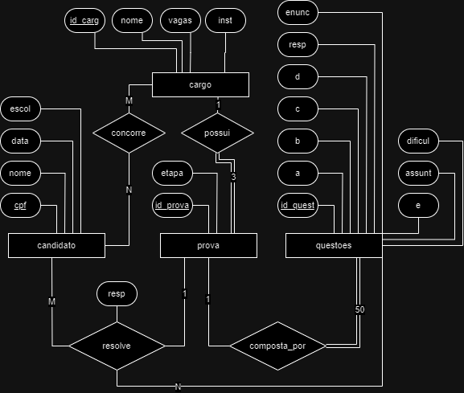
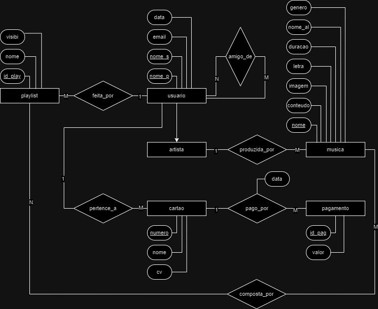
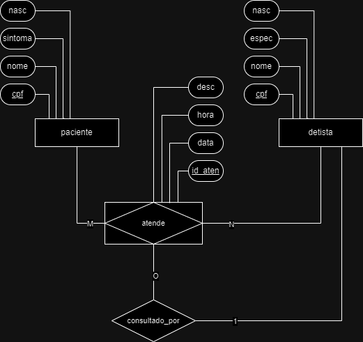

# Resultados da lista de exercicios Modelo ER

## Questões

1. No modelo ER, dê o conceito de entidade forte e de entidade fraca.

    Uma entidade forte é aquela que pode ser identificada independentemente de qualquer outra entidade no modelo. Ela possui um identificador próprio.

    Já uma entidade fraca depende de outra entidade para sua identificação, ou seja, não pode existir sem uma entidade relacionada chamada de entidade proprietária.

2. Dê ao menos dois exemplos de cada um dos conceitos básicos da abordagem ER:
entidade, relacionamento, atributo.

    Entidade: Cliente, Produto.
    Relacionamento: Compra (entre Cliente e Produto), Pertence (entre Produto e Categoria).
    Atributo: Nome (atributo de Cliente), Preço (atributo de Produto).

3. Como podem ser classificados os atributos? No modelo ER, como cada
classificação é representada?

    Os atributos podem ser classificados como simples ou compostos, monovalentes ou multivalentes e atributos derivados.

    **Atributo Simples:**
    Na representação simbólica, um atributo simples é indicado apenas pelo seu nome, sem qualquer adornamento adicional. Por exemplo, se tivermos um atributo simples "Nome" para a entidade "Cliente", seria representado simplesmente como "Nome".

    **Atributo Composto:**
    Um atributo composto é representado por meio de uma estrutura que lista seus componentes individuais entre chaves {}. Por exemplo, se tivermos um atributo composto "Endereço" com componentes "Rua", "Cidade" e "CEP", seria representado como "{Rua, Cidade, CEP}".

    **Atributo Monovalente e Multivalente:**
    A diferença entre mono e multivalente é expressa na representação simbólica pela presença de um único valor ou de múltiplos valores, respectivamente, para o atributo. Não há um símbolo específico para isso, mas a interpretação é feita com base no contexto do modelo.
    
    **Atributo Derivado:**
    Um atributo derivado é representado por meio de uma linha pontilhada ou tracejada que conecta o atributo derivado à entidade ou relacionamento do qual ele é derivado. Essa linha é rotulada com o atributo derivado. Por exemplo, se tivermos um atributo derivado "Idade" derivado da data de nascimento de um Cliente, seria representado por uma linha pontilhada conectando "Data de Nascimento" à entidade "Cliente", rotulada como "Idade".

4. Explique o que é cardinalidade, e o que significa dizer que a cardinalidade em um
relacionamento binário é um-para-um ou um-para-muitos. Exemplifique.

    A cardinalidade em um relacionamento indica o número de ocorrências de uma entidade que pode estar associado a outra entidade através do relacionamento.

    Um-para-um significa que uma instância de uma entidade pode estar associada a no máximo uma instância da outra entidade, e vice-versa.

    Um-para-muitos significa que uma instância de uma entidade pode estar associada a zero ou mais instâncias da outra entidade, mas uma instância da outra entidade só pode estar associada a no máximo uma instância da primeira entidade.

5. Dado o diagrama E-R abaixo de uma administradora de imóveis, identifique as
restrições de participação de cada relacionamento, explicando o caso de
participação total ou parcial, identifique as chaves primárias, as chaves parciais e
as entidades fracas. Explique as restrições que deram origem ao diagrama
explicando os relacionamentos entre as entidades.

Relações:
- Um corretor pode administrar n imóveis e um imóvel pode ser administrador por n corretores (M to N).

- Um imóvel pode ter apenas um IPTU e um IPTU está associado a apenas um imóvel (1 to 1, obrigatório), relação fraca.

- Um proprietário pode ter M imóveis e um proprietário pode ter N clientes (M to N).

- Um locatario pode alugar M imóveis e um locatário pode ser um cliente (M to 1).

## Questões de desenvolvimento de diagramas ER

| Questão | Descrição |
| ------- | --------- |
|  | Questão 6: Sistema de periódicos |
|  | Questão 7: Sistema para concurso |
|  | Questão 8: Sistema Spotify |
|  | Questão 9: Sistema de clínica |

