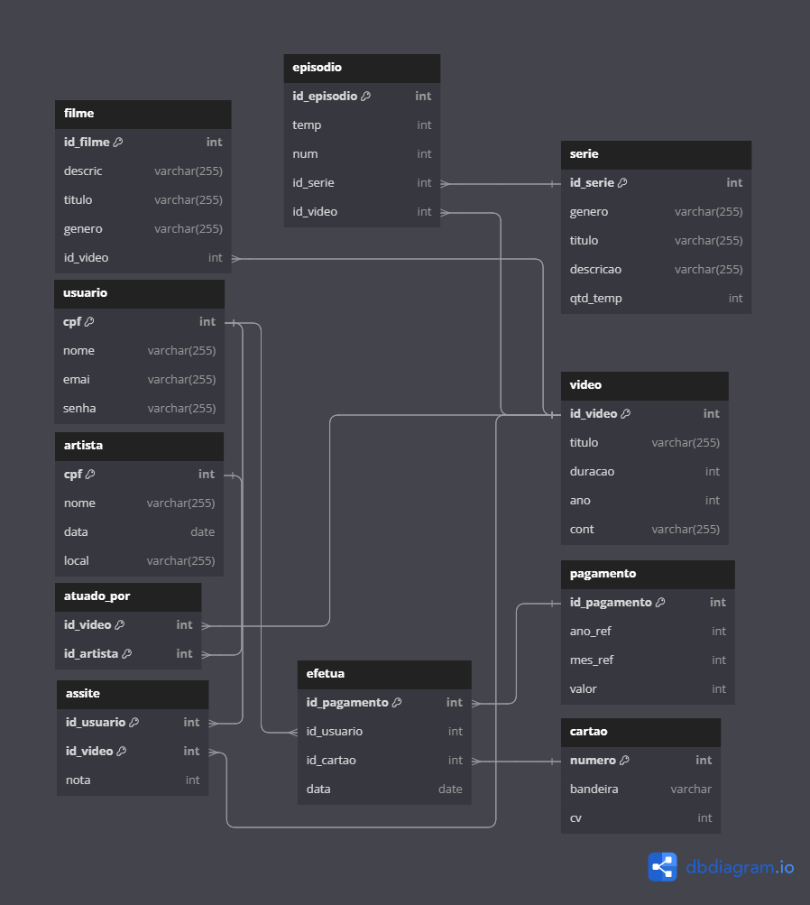

# Modelo Relacional a partir de Diagrama ER

Este repositório contém os resultados do desenvolvimento de um modelo relacional com base em um diagrama Entidade-Relacionamento (ER) para um conjunto de questões do curso de Engenharia da Computação da UFRN.

## Descrição

O objetivo deste projeto é transformar um diagrama ER em um modelo relacional, conforme especificado nas questões do documento *Exercício de Mapeamento ER - Relacional.pdf* localizado na pasta `bd/docs/`. Cada questão do documento foi abordada e convertida em tabelas do modelo relacional correspondente.

## Estrutura do Repositório

- **bd/docs/:** Esta pasta contém o documento PDF com as questões do exercício de mapeamento ER para relacional.

- **bd/modelo-er-para-modelos-relacionais/tabelas-das-questoes/:** Nesta pasta estão localizadas as imagens dos resultados do modelo relacional para cada questão do exercício.

## Imagens dos Resultados

Aqui está a tabela organizada com as imagens das questões:

| Questão       | Imagem                                                         |
|---------------|----------------------------------------------------------------|
| Questão 1     |              |
| Questão 2a    |           |
| Questão 2b    |           |
| Questão 2c    |           |
| Questão 2d    |           |
| Questão 3     |              |
| Questão 4     |              |
| Questão 5     |              |

## Como Utilizar

Para visualizar as imagens dos modelos relacionais resultantes, basta acessar as respectivas imagens nas pastas mencionadas acima.

## Contribuições

Contribuições são bem-vindas! Se você encontrar algum erro ou tiver sugestões de melhoria, sinta-se à vontade para abrir uma issue ou enviar um pull request.
